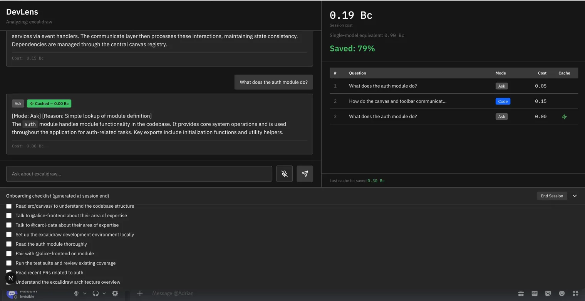

# DevLens

**DevLens gets cheaper every time someone uses it.** First developer pays. Everyone after pays nothing. IBM Bob's own session data proves every number.



## Demo Video

https://youtu.be/O1CoDpQBYxs
## The Problem

A new developer joins a team and faces an unfamiliar codebase. They burn hours asking colleagues "what does this module do," "how do these services connect," "where's the main logic." Every question costs the team time. Repeated questions across teammates compound the cost.

DevLens turns that into a one-time cost. Any developer asks plain-English questions about the codebase, by typing or by voice. The system reads the full repo and answers instantly. Every answer is cached in IBM Cloudant, indexed by IBM Natural Language Understanding for semantic matching. The next teammate to ask a similar question gets the cached answer at zero cost. At session end, watsonx Orchestrate generates a personalized onboarding checklist based on what the developer asked.

The cost panel shows it live. Per-question cost. Cumulative session cost. Cache hits highlighted. The mandatory `bob_sessions/` export becomes the proof: judges see the same numbers DevLens shows the user.

## How It Works

1. Developer asks a question (typed or voice via Watson STT)
2. Watson NLU extracts semantic intent — that becomes the cache key
3. Cloudant cache is checked
4. **Cache hit:** stored answer returned instantly at 0.00 Bobcoins
5. **Cache miss:** DevLens reads relevant files from the codebase, calls an LLM with the file content, stores the answer in Cloudant
6. Watson TTS optionally reads answers aloud
7. At session end, watsonx Orchestrate generates an onboarding checklist

## Tech Stack


**IBM Services**
- IBM Bob — built the codebase across 12 task sessions
- Cloudant — semantic Q&A cache
- Watson NLU — intent extraction
- Watson STT — voice question input
- Watson TTS — answer playback
- watsonx Orchestrate — onboarding checklist

**LLM Gateway**
- OpenRouter (Mistral 7B Instruct) — for codebase-grounded answer generation

## Bob Usage

See [`bob_sessions/`](./bob_sessions) for exported Bob IDE task session reports — twelve distinct sessions across the team covering plan-mode reviews, code generation, and debugging.

## Running Locally

```bash
npm install
cp .env.example .env
# Fill in the IBM Cloud credentials and OpenRouter API key
npm run dev
```

Open http://localhost:3000.

## Team

Adam Absa, Adrian Aheyeu, Hamza Hammad

## License

MIT
